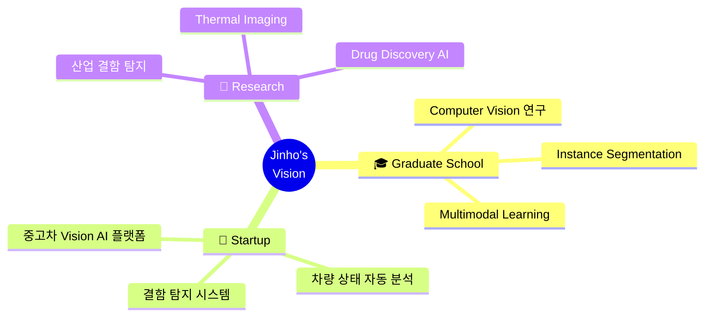

<h1 align="center">
  
</h1>

<p align="center">
  <a href="https://github.com/Wlsghdh"></a>
  <a href="mailto:wlsgh20728@suwon.ac.kr"></a>
</p>

<div align="center">

  ```
   ██████╗ ██████╗ ███╗   ███╗██████╗ ██╗   ██╗████████╗███████╗██████╗
  ██╔════╝██╔═══██╗████╗ ████║██╔══██╗██║   ██║╚══██╔══╝██╔════╝██╔══██╗
  ██║     ██║   ██║██╔████╔██║██████╔╝██║   ██║   ██║   █████╗  ██████╔╝
  ██║     ██║   ██║██║╚██╔╝██║██╔═══╝ ██║   ██║   ██║   ██╔══╝  ██╔══██╗
  ╚██████╗╚██████╔╝██║ ╚═╝ ██║██║     ╚██████╔╝   ██║   ███████╗██║  ██║
   ╚═════╝ ╚═════╝ ╚═╝     ╚═╝╚═╝      ╚═════╝    ╚═╝   ╚══════╝╚═╝  ╚═╝
  ██╗   ██╗██╗███████╗██╗ ██████╗ ███╗   ██╗
  ██║   ██║██║██╔════╝██║██╔═══██╗████╗  ██║
  ██║   ██║██║███████╗██║██║   ██║██╔██╗ ██║
  ╚██╗ ██╔╝██║╚════██║██║██║   ██║██║╚██╗██║
   ╚████╔╝ ██║███████║██║╚██████╔╝██║ ╚████║
    ╚═══╝  ╚═╝╚══════╝╚═╝ ╚═════╝ ╚═╝  ╚═══╝
  ```

</div>

---

## 👁️ About Me

> *"Do it better"* — 데이터로 세상을 보고, Vision으로 가치를 만듭니다.

**수원대학교**에서 데이터과학을 공부하고 있는 **주진호**입니다.
**Computer Vision**과 **Deep Learning**을 중심으로 연구하며, AI 기술로 실제 문제를 해결하는 데 열정을 가지고 있습니다.

- 🔬 **연구 관심사:** Instance Segmentation, Object Detection, Multimodal Learning
- 🎓 **목표:** 대학원 진학 (Computer Vision / AI 분야)
- 🚀 **창업 비전:** Vision AI를 활용한 중고차 플랫폼 개발
- 📍 **소속:** 수원대학교 (Suwon University)

---

## 🛠️ Tech Stack

<p align="center">

**Languages & Core**


**Deep Learning & Vision**


**Data & Visualization**


</p>

---

## 🔥 Featured Projects

<table>
<tr>
<td width="50%">

### 👁️ VISION Instance Segmentation
[](https://github.com/Wlsghdh/VISION-Instance-Seg)

**Swin Transformer + Mask2Former**를 활용한 산업 결함 탐지 시스템.
Instance Segmentation 기반으로 제조 공정의 불량을 자동으로 검출합니다.

`Swin Transformer` `Mask2Former` `Instance Seg` `Python`

</td>
<td width="50%">

### 🔥 Gas Leakage Multimodal Detection
[](https://github.com/Wlsghdh/GasLeakage-MultiModal-MTF)

센서 데이터와 **열화상 이미지**를 결합한 멀티모달 가스 누출 감지.
Multi-Task Fusion으로 다중 데이터 소스를 통합 분석합니다.

`Multimodal` `Thermal Imaging` `MTF` `Python`

</td>
</tr>
<tr>
<td width="50%">

### 🧬 AI Drug Discovery
[](https://github.com/Wlsghdh/Jump-AI-2025)

**MAP3K5 IC50 Prediction** — AI 기반 신약 개발 프로젝트.
분자 구조 데이터를 활용한 약물 활성도 예측 모델을 개발합니다.

`Drug Discovery` `IC50` `Molecular AI` `Python`

</td>
<td width="50%">

### 🧠 ResNet Without Skip Connection
[](https://github.com/Wlsghdh/resnet-without-skip-connection)

Skip Connection 없이 ResNet의 성능을 테스트하는 실험.
Weight Initialization 전략만으로 깊은 네트워크 학습을 탐구합니다.

`ResNet` `Ablation Study` `Weight Init` `Deep Learning`

</td>
</tr>
</table>

---

## 🚀 Vision & Goals



---

## 📊 GitHub Stats

<p align="center">
  
  
</p>

<p align="center">
  
</p>

---

## 🏆 GitHub Achievements

<p align="center">
  
</p>

---

<p align="center">
  
</p>

<p align="center">
  <b>👁️ "Seeing the world through data, creating value through Vision AI"</b>
</p>

<p align="center">
  
</p>
